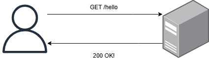
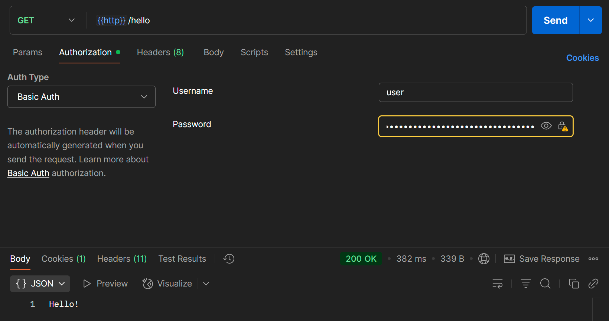
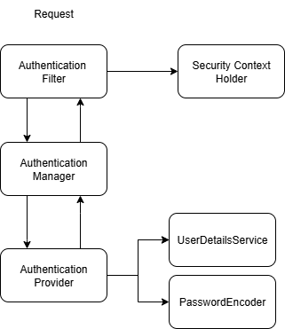

# Spring Security 2장

**학습 목표**
- 스프링 시큐리티 첫 프로젝트 만들기
- **인증과 권한 부여를 위한 기본 구성 요소로 간단한 기능 설계**
- 구성 요소가 서로 어떻게 연관되는지 이해하기 위한 기본 계약 적용
- 주 책임에 대한 구현 작성
- 스프링 부트의 기본 구성 재정의

> [!NOTE]
> 스프링 부트는 미리 준비된 구성을 제공하므로 모든 구성을 작성하는 대신 일치하지 않은 부분만 재정의한다.   
> 이 접근법을 **설정보다 관습(convention-over-configuration)** 이라고 한다.

## First Step
1. REST API 하나를 노출하는 작은 웹 애플리케이션을 만든다.
2. security, web 종속성을 추가한다.
3. HTTP Basic을 이용해 사용자 인증

**주 목적**
- 스프링 시큐리티의 기본 구성이 어떻게 동작하는지 확인한다.

### 결과

기본 구성으로 올바른 종속성이 이용되도록하는 것을 확인할 수 있다.

## 기본 구성 재정의
> [!IMPORTANT]
> 스프링 시큐리티는 구성을 여러 방식으로 재정의할 수 있다.   
> 이 유연성 때문에 혼란을 느끼거나 복잡해질 수 있다. 이는 바람직하지 않다. 즉, 유연성을 남용해서는 안 된다.   

`UserDetailsService`와 `PasswordEncoder` 를 구성하는 방법을 배운다.

### 구성 재정의 변경점
> [!IMPORTANT]
> `WebSecurityConfigurerAdapter` 는 지원이 중단되어 더 이상 사용하지 않습니다.

[Spring Docs-구성하는 방법](https://docs.spring.io/spring-security/reference/servlet/authentication/passwords/index.html)

### `AuthenticationManager` 빈 구성
앞서 `UserDetailsService`, `PasswordEncoder` 객체를 빈으로 등록하여 자동으로 `AuthenticationProvider` 에 등록했습니다.

이번에는 다른 방식인 `AuthenticationManager`를 빈으로 등록하여 두 객체를 등록하는 방법에 대해서 알아보겠습니다.

`AuthenticationManager` 에는 여러 `ProviderManager` 를 등록하고 특정 유형에 맞는 Provider를 이용해서 인증을 할 수 있습니다.   
[Spring - AuthenticationManager](https://docs.spring.io/spring-security/reference/servlet/authentication/architecture.html#servlet-authentication-authenticationprovider)

- spring security provider 는 기본적으로 유저이름과 패스워드 기반으로 인증한다.
- `DaoAuthenticationProvider`
- HttpBasic -> `BasicAuthenticationFilter` 가 필터 체인에 등록된다.
- 필터가 아이디 패스워드를 추출하여 `AuthenticationManager`에게 위임합니다.

시큐리티는 사용자의 요청을 가로채서 등록된 필터를 이용하여 인증 인가를 처리합니다.   
여러 필터를 등록해서 적절한 처리를 할 수 있습니다. 하지만, 우선 책의 흐름에 따라서 기본적인 흐름을 학습을 우선합니다.

### Authentication Provider 구현 재정의
앞서 다양한 방법으로 인증 로직을 처리하는 `UserDetailsService`와 `PasswordEncoder` 를 등록하는 방법을 알아보았다.
1. `Spring Context` 가 관리하는 Bean으로 `UserDetailsService` 와 `PasswordEncoder` 를 자동으로 구성하는 방법
2. `AuthenticationManager` 빈을 통해서 `Provider`에 등록

이처럼 스프링 시큐리티 구성 요소는 유연하게 다양한 옵션을 선택할 수 있었습니다.

이제 이들 구성 요소에 작업을 위임하는 `AuthenticationProvider`를 맞춤 구성할 수 있습니다.

> [!INFO]
> `Authentication Provider`는 인증 논리를 구현합니다. `Manager`에게 요청을 받은 후 사용자를 찾는 작업을 `UserDetailsSerivce`에, 
> 암호를 검증하는 작업을 `PasswordEncoder`에 위임합니다.

## 요약
1. Security 종속성 추가만으로 스프링 부트가 기본 구성을 제공한다.
2. 인증과 권한 부여를 위한 기본 구성 요소인 `UserDetailsService`, `PasswordEncoder`, `AuthenticationProvider`를 구현했다.
3. `AuthenticationProvider` 계약을 이용해서 맞춤형 인증 논리를 구현할 수 있다.
4. Spring Security Configuration을 구성하는 방법은 여러가지가 있지만, 설정보다 관습을 따른다.
