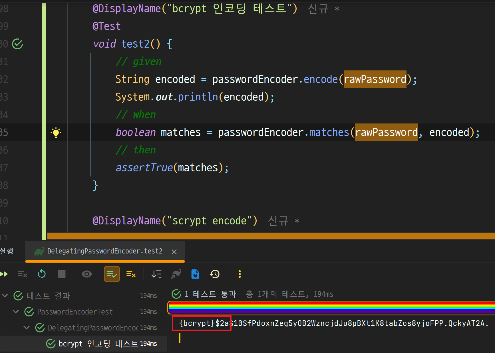

# 4장 암호 처리

- `PasswordEncoder` 의 구현 및 이용
- 스프링 시큐리티 암호화 모듈에 있는 툴 이용

# PasswordEncoder 계약의 이해

> 인증 프로세스, `AuthenticationProvider` 는 인증 프로세스에서 `PasswordEncoder` 를 이용해 사용자 의 암호를 검증한다.

# DelegatingPasswordEncoder 를 이용한 여러 인코딩 전략
인증 과정에서 암호 일치를 위해 다양한 인코딩 구현을 적용해야 할 때가 있습니다.

이때 유용하게 사용할 수 있는 도구가 `DelegatingPasswordEncoder`입니다. 이 클래스는 직접 인코딩 로직을 구현하지 않고, `PasswordEncoder` 인터페이스를 구현한 다른 객체에 작업을 위임합니다.

일부 애플리케이션에서는 여러 암호 인코더를 동시에 갖추고, **상황이나 구성에 따라 적절한 인코더를 선택하는 방식**이 필요할 수 있습니다.

- `DelegatingPasswordEncoder`는 `PasswordEncoder`와 동일하게 동작하지만, 내부적으로 여러 인코더를 등록해두고 prefix를 기준으로 어떤 인코더를 사용할지 결정합니다.
- 기본값(`idForEncode`)은 보통 `bcrypt`로 지정되며, `encode()`를 호출하면 `{bcrypt}...` 형태로 저장됩니다.

